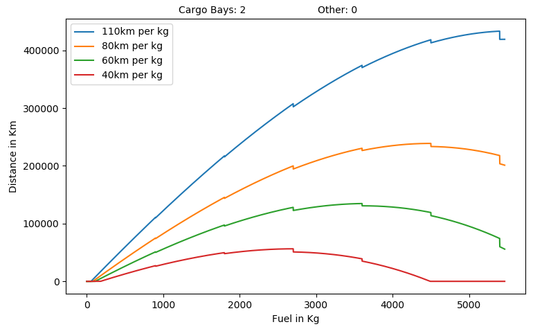

### Rocket Distance
* Graphs a rocket's distance. Good for if you want to modify rocket values and see how rocket mechanics are affected. You can easily modify the rocket at the top of the file.
* Equations obtained from Assembly-CSharp.RocketStats.GetRocketMaxDistance

